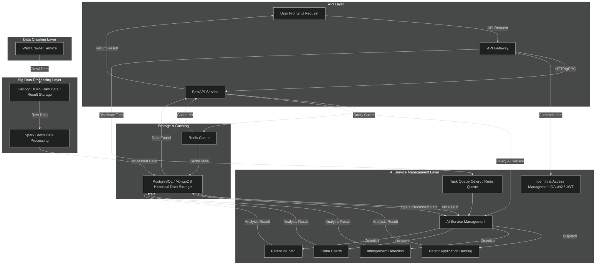

# Infringement services

## Technology Stack and Features

- ⚡ [**FastAPI**](https://fastapi.tiangolo.com) for the Python backend API.
- 💾 [PostgreSQL](https://www.postgresql.org) as the SQL database.
- 🚀 [React](https://react.dev) for the frontend.
- 🐋 [Docker Compose](https://www.docker.com) for development and production.

### Dashboard Login

[](https://github.com/fastapi/full-stack-fastapi-template)

### Dashboard - Admin

[](https://github.com/fastapi/full-stack-fastapi-template)

### Dashboard - Create User

[](https://github.com/fastapi/full-stack-fastapi-template)

### Dashboard - Items

[](https://github.com/fastapi/full-stack-fastapi-template)

### Dashboard - User Settings

[](https://github.com/fastapi/full-stack-fastapi-template)

### Dashboard - Current Companies

[](https://github.com/fastapi/full-stack-fastapi-template)

### Dashboard - Current Patents

[](https://github.com/fastapi/full-stack-fastapi-template)

### Dashboard - Infringement Analysis

[](https://github.com/fastapi/full-stack-fastapi-template)

### Dashboard - Dark Mode

[](https://github.com/fastapi/full-stack-fastapi-template)

### Interactive API Documentation

[](https://github.com/fastapi/full-stack-fastapi-template)

## Database ER Diagram


## How to start the services

1. Change the value of `OPENAI_API_KEY` in the `.env` file to your key. This free key can be obtained from [FreeChatgptAPI](https://github.com/popjane/free_chatgpt_api?tab=readme-ov-file#%E9%A1%B9%E7%9B%AE%E4%BB%8B%E7%BB%8D).

2. Run the following command to start the services:
```bash
docker-compose up -d
```

3. Open your browser and go to `http://localhost:5173/login`.

4. You can log in with the default admin user below:
- **Username:** `james_test@yopmail.com`
- **Password:** `password`


## Optimized system design for the best performance and scalability.
